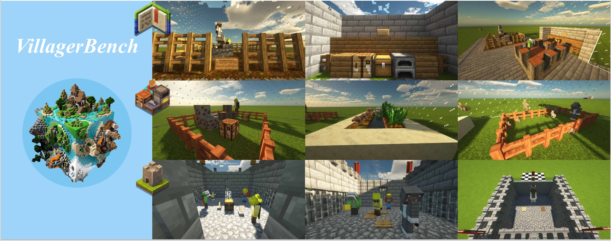
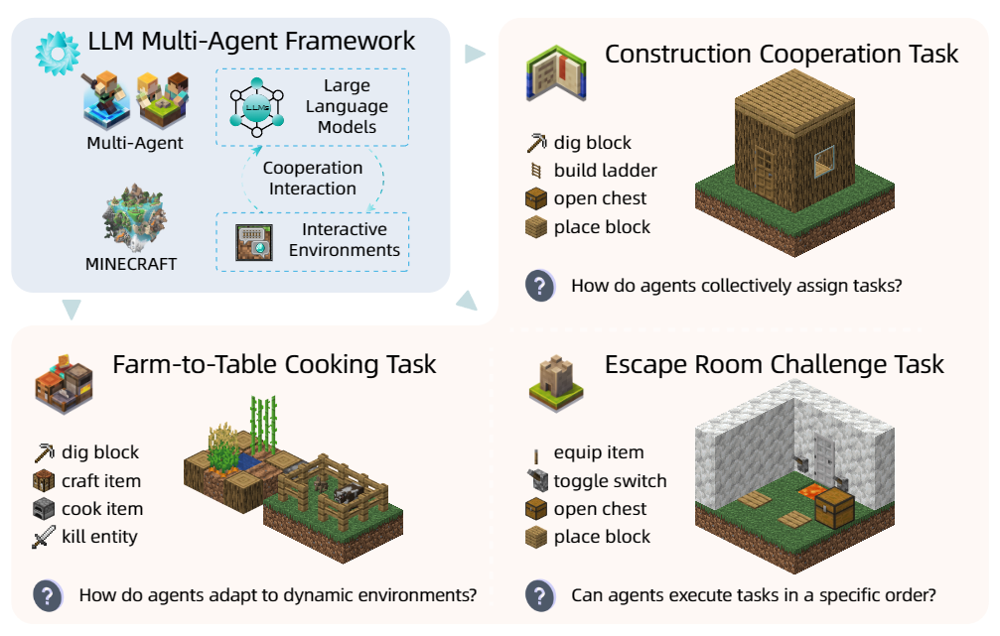
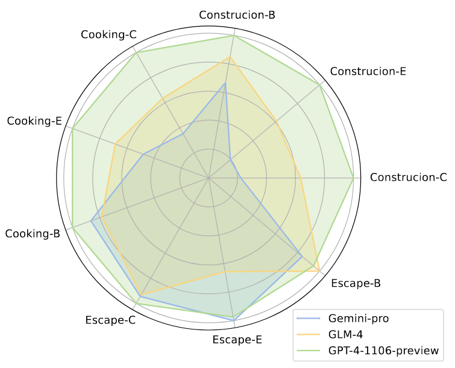
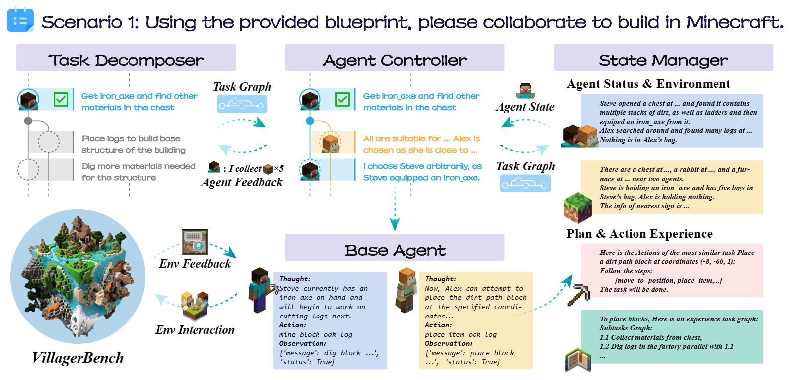

# 🏰 VillagerAgent: A Graph-Based Multi-Agent Framework for Coordinating Complex Task Dependencies in Minecraft 🌍

 


Welcome to VillagerBench, where the blocky world of Minecraft isn't just for fun and games—it's a testing ground for the cutting-edge of multi-agent collaboration! 🤖 Our benchmark suite is designed to push the boundaries of what virtual agents can achieve together, tackling everything from construction projects 🏗️ to culinary quests 🍳 and escape room puzzles 🔐.

Customize your private tasks in your Minecraft server with our VillagerAgent multi-agent framework, designed for personalized gameplay experiences! 🌟 
点击此处查看 [中文版 README](READMEzh.md)。
<p align="center">
    <a href='https://arxiv.org/'>
      
    </a>
    <a href='https://cnsdqd-dyb.github.io/VillagerAgent.github.io/2024/04/01/VillagerAgent.html'>
      
    </a>
</p>

---
## Setup and Configuration 🛠️

### Requirements
- **Python Version**: Python 3.8 or newer installed on your system.
- **API Keys**: Obtain API keys from one or more of the following services:
  - OpenAI (for access to models like GPT-4)
  - Google Cloud (for access to models like Gemini)
  - Zhipu AI (for access to GLM models)
- **NPM Package**: Node Package Manager (npm) installed, which is typically included with Node.js：
  ```python
  python js_setup.py
  ```
- **Minecraft Server**: If you want to know how to configure the Minecraft 1.19.2 server, please see the [tutorial here](#minecraft-1192-server-setup).
- **Python Dependencies**: Install all necessary Python libraries as specified in the `requirements.txt` file. You can install these dependencies using the following command:
  ```
  pip install -r requirements.txt
  ```
- **Other Model Choice**: You have the option to use models from Hugging Face's Transformers library. Ensure you have the necessary credentials to use and download the model.

### Installation Steps
1. Clone the repository 📦:
   ```bash
   git clone https://github.com/VillagerAgent.git
   ```
2. Opt for a virtual environment 🧹:
   ```bash
   python -m venv venv
   source venv/bin/activate  # On Windows, try venv\Scripts\activate
   ```
3. Install the dependencies 🧑‍🍳:
   ```bash
   pip install -r requirements.txt
   ```
4. Set up your API key 🗝️:
   - Craft a file named `API_KEY_LIST` and inscribe your API key in this way:
   ```json
   {
      "OPENAI":["put your openai key here", ...],
      "GEMINI":[...],
      "GLM":[...],
      ...
   }
   ```
   - We might try calling multiple available APIs to break through the access limit.
   - Place this file in the root of the project directory.

## QuickStart 🚀

```python
from env.env import MaMcEnv, env_type, Agent
from pipeline.controller import GlobalController
from pipeline.data_manager import DataManager
from pipeline.task_manager import TaskManager
import json

if __name__ == "__main__":

    # 🌍 Set Environment
    env = MaMcEnv(env_type.construction, task_id=0, _virtual_debug=False, dig_needed=False)

    # 🤖 Set Agent
    api_key_list = json.load(open("API_KEY_LIST", "r"))["OPENAI"]  # 🗝️ Use OPENAI as an example
    base_url = "base url of the model"
    llm_config = {
        "api_model": "fill in the model name here",  # For example, "gpt-4-1106-preview"
        "api_base": base_url,  # 🔗 For example, "https://api.openai.com/v1"
        "api_key_list": api_key_list
    }

    Agent.model = "fill in the agent model name here"  # 🛠️ Customize your agent model
    Agent.base_url = base_url
    Agent.api_key_list = api_key_list

    # 🔨 More agent tools can be added here - refer to the agent_tool in doc/api_library.md
    agent_tool = [Agent.fetchContainerContents, Agent.MineBlock, ..., Agent.handoverBlock]

    # 📝 Register Agent
    env.agent_register(agent_tool=agent_tool, agent_number=3, name_list=["Agent1", "Agent2", "Agent3"])  # Ensure the agent number matches the agent_tool
    # ⚠️ Use /op to give the agent permission to use commands on the Minecraft server, e.g., /op Agent1

    # 🏃‍♂️ Run Environment
    with env.run():
        
        # Set Data Manager
        dm = DataManager(silent=False)
        dm.update_database_init(env.get_init_state())

        # Set Task Manager
        tm = TaskManager(silent=False)

        # Set Controller
        ctrl = GlobalController(llm_config, tm, dm, env)

        # Set Task
        tm.init_task("Write your task description here.", json.load(open("your json task related file here if any.")))

        # 🚀 Run Controller
        ctrl.run()
```

### Batch Testing 🧪
- Whip up test configs with `config.py` 📝.
- Kick off automated batch testing with `start with config.py` 🤖.


### Docker 🐳
- Build your Docker image with `docker build -t VillagerAgent .` 🏗.
- Launch the Docker container with `docker run VillagerAgent` 🚀.
- Note: If you need to open specific ports for API connectivity, you may need to modify the Dockerfile accordingly and launch with `docker run -p <your_port>:<app_port> VillagerAgent` 🌐.

## Overview 📜

### VillagerBench
Dive into VillagerBench, powered by Mineflayer, to explore the dynamics of cooperative AI. Our agents don't just play—they learn 🎓, adapt 🔄, and work together to overcome challenges that would stump the lone wolf 🐺.

 
 

### VillagerAgent Framework
Meet VillagerAgent, our multi-agent maestro 🎼, orchestrating a symphony of tasks with its four core components: Task Decomposer, Agent Controller, State Manager, and Base Agents. It's like a conductor for AI, turning individual actions into a masterpiece of collaboration.

 

## Core Components 🌟

- **MaMcEnv**: The virtual sandbox where agents interact and learn 🤹.
- **TaskManager**: The master planner, keeping tasks on track and agents in the know 📊.
- **DataManager**: The keeper of knowledge, holding all the data cards close to its chest 🗃️.
- **GlobalController**: The overseer, ensuring every agent plays their part to perfection 🎯.


## npm Installation
### Windows

1. **Download the Node.js Installer**:
   - Visit the [Node.js official website](https://nodejs.org/).
   - Download the latest stable version of the Node.js installer for Windows (the LTS version is usually recommended).

2. **Run the Installer**:
   - Double-click the downloaded installer file.
   - Follow the instructions provided by the installation wizard. Make sure to include all necessary components, including npm, during the installation process.

3. **Verify Installation**:
   - Open Command Prompt or PowerShell.
   - Enter the following commands to check the versions of Node.js and npm:
     ```
     node -v
     npm -v
     ```
   - If the installation was successful, you will see the version numbers of Node.js and npm displayed.

### Linux (Debian/Ubuntu-based)

1. **Install Using Package Manager**:
   - Open the terminal.
   - First, update your package index:
     ```
     sudo apt update
     ```
   - Install Node.js and npm:
     ```
     sudo apt install nodejs npm
     ```

2. **Install Using nvm** (Node Version Manager, recommended for managing multiple versions of Node.js):
   - Open the terminal.
   - Install nvm by running:
     ```
     curl -o- https://raw.githubusercontent.com/nvm-sh/nvm/v0.39.1/install.sh | bash
     ```
   - Restart the terminal or run the following command to update the current session:
     ```
     export NVM_DIR="$([ -z "${XDG_CONFIG_HOME-}" ] && printf %s "${HOME}/.nvm" || printf %s "${XDG_CONFIG_HOME}/nvm")"
     [ -s "$NVM_DIR/nvm.sh" ] && \. "$NVM_DIR/nvm.sh" # This loads nvm
     ```
   - Install Node.js using nvm (this will also install npm):
     ```
     nvm install node
     ```

3. **Verify Installation**:
   - Type the following commands to check the versions of Node.js and npm:
     ```
     node -v
     npm -v
     ```
   - If the installation was successful, you will see the version numbers of Node.js and npm displayed.


## Minecraft 1.19.2 Server Setup
### Preparation

1. **Ensure Java is Installed**: Minecraft servers require the Java runtime environment. Make sure you have the latest version of Java installed on your computer. You can check if Java is installed by running `java -version` in the command line.

2. **Download Server File**: Visit the official Minecraft website to download the 1.19.2 version of the server file (`minecraft_server.1.19.2.jar`).

### Configuring the Server

1. **Create a Server Folder**: Choose a location on your computer to create a new folder that will hold all the Minecraft server files.

2. **Move Server File**: Move the downloaded server file (`minecraft_server.1.19.2.jar`) into the folder you created.

3. **Run the Server**:
   - Open the command line interface.
   - Navigate to the folder containing the server file using the `cd` command.
   - Run the following command to start the server:
     ```
     java -Xmx1024M -Xms1024M -jar minecraft_server.1.19.2.jar nogui
     ```
   - The `-Xmx1024M` and `-Xms1024M` parameters set the maximum and initial memory allocation for the server in megabytes (MB). You may need to adjust these values based on your server's hardware.

4. **Accept the EULA**: The first time you run the server, a file named `eula.txt` will be generated. Open this file and change `eula=false` to `eula=true` to accept the Minecraft End User License Agreement.

5. **Restart the Server**: Run the `java` command again to start the server.

### Configuring Server Properties

1. **Edit the `server.properties` File**: After the first server run, a configuration file named `server.properties` will be generated. You can edit this file to customize the server settings, such as game mode, difficulty, etc. If you are testing the capabilities of multiple agents on VillagerBench, set the mode to peaceful and the terrain to superflat.

2. **Port Forwarding**: If you want other players to be able to access your server from outside networks, you may need to set up port forwarding on your router. By default, the Minecraft server uses port 25565.

3. **Start and Test the Server**: After completing all the settings, restart the server and try connecting to it to ensure everything is running smoothly.

### Important Notes

- Ensure that any agents that may join the server have been granted admin privileges (you can add permissions with the command `/op agent_name`).
- Make sure your server's firewall rules allow the port used by the Minecraft server.
- Regularly back up your server files to prevent data loss.
- Keep the server's Java version up to date for optimal performance and security.

The steps above provide a basic tutorial for setting up a Minecraft server. Depending on your specific needs and configuration, more advanced settings may be required.

## Contribution Guide 🤝

Jump on board! We love contributions. Before you submit your pull request, make sure:
- Your changes have aced the tests 🏆.
- You've spruced up the docs (if you've added some pizzazz) 📚.

## License 📜

This project is all yours under the [MIT License](LICENSE).
