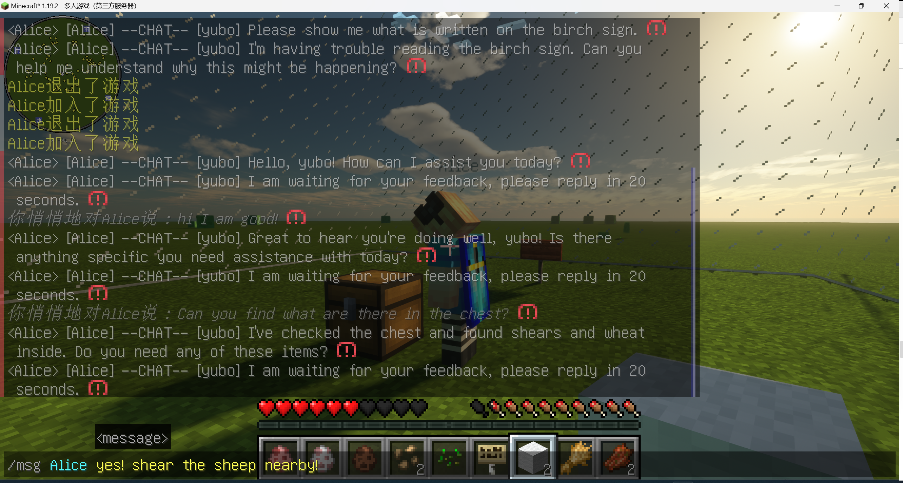
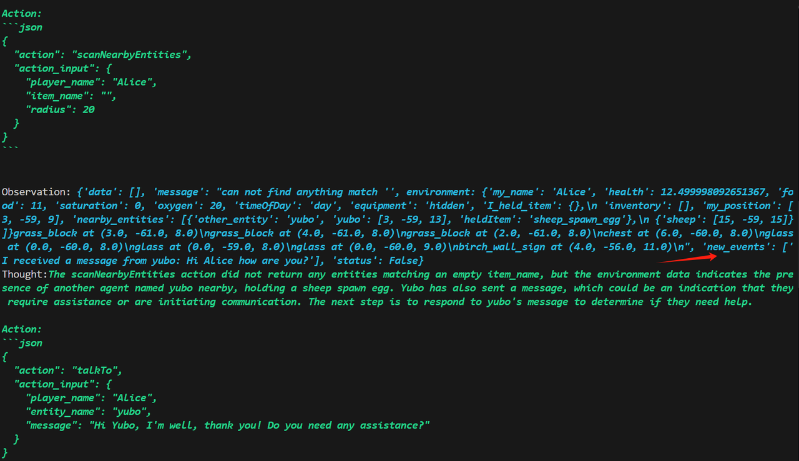
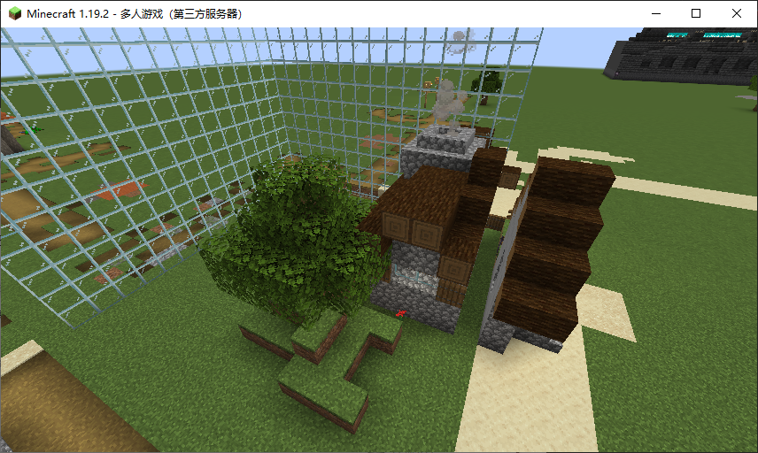
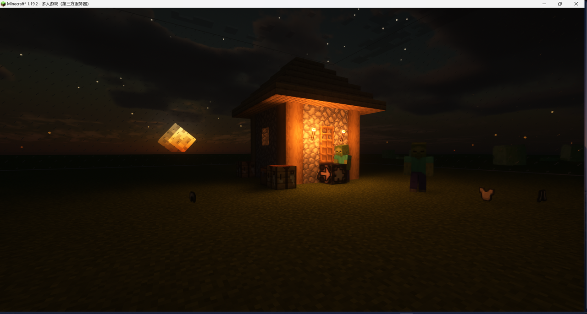
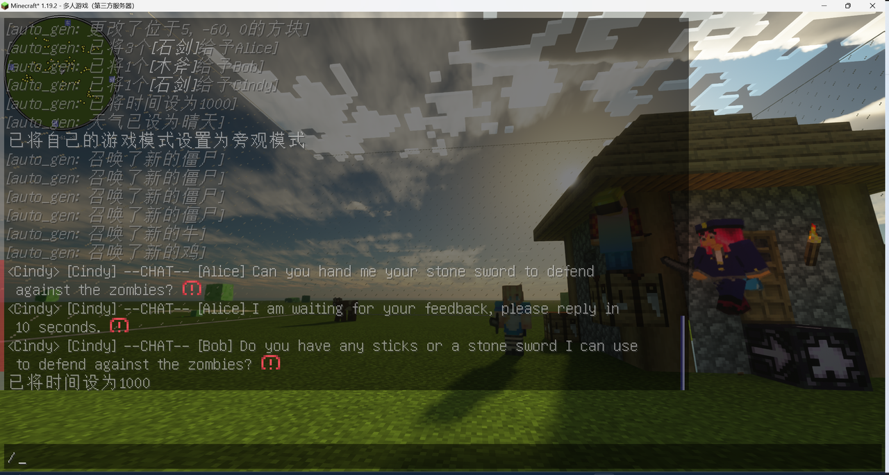

# 🏰 VillagerAgent: Minecraftの複雑なタスク依存関係を調整するためのグラフベースのマルチエージェントフレームワーク 🌍

 

私たちは、Minecraft環境内でのエージェント間の相互作用と、プレイヤーとの協力を調査することを目指しています。同時に、タスク分解と協力における大規模言語モデル（LLM）の能力を探求します。

VillagerBenchへようこそ。ここでは、Minecraftのブロックの世界が単なる遊び場ではなく、最先端のマルチエージェント協力のテストグラウンドです！ 🤖 私たちのベンチマークスイートは、エージェントが協力して達成できる限界を押し広げ、建設プロジェクト 🏗️ から料理のクエスト 🍳、脱出ゲームのパズル 🔐 まで、さまざまな課題に挑戦します。

VillagerAgentのマルチエージェントフレームワークを使用して、Minecraftサーバーでプライベートタスクをカスタマイズし、個別のゲームプレイ体験を提供します！ 🌟 
クリックして [英語版 README](README.md) をご覧ください。
<p align="center">
    <a href='https://arxiv.org/abs/2406.05720'>
      
    </a>
    <a href='https://cnsdqd-dyb.github.io/VillagerAgent.github.io/2024/04/01/VillagerAgent.html'>
      
    </a>
</p>

---

## ニュース
\[2024.12.11\] PPOメソッドを使用したLLM APIランキングのサポート。

\[2024.12.08\] エージェントチューニングのためのデータを取得するためのLLM駆動のAutoGenタスク。

<table> <tr> <td></td> <td></td> </tr> <tr> <td></td> <td></td> </tr> </table>

\[2024.12.01\] \[人間 -- エージェント\]  \[エージェント -- エージェント\] リアルタイムチャットがサポートされました!!!🎉

<table> <tr> <td></td> <td></td> </tr>  </table> 

\[2024.10.23\] VillagerAgentのLLMを微調整されたオープンソースLLMに置き換えて、エージェントのタスク実行の性能と効率を向上させることを試みています。

\[2024.10.04\] 🎉私たちのMinecraftマルチエージェントフレームワークVillagerAgentがACL 2024に受理されました。
## セットアップと構成 🛠️

### 要件
- **Pythonバージョン**：システムにPython 3.8以上がインストールされていること。
- **APIキー**：以下のサービスのいずれかからAPIキーを取得：
  - OpenAI（GPT-4などのモデルへのアクセス用）
  - Google Cloud（Geminiなどのモデルへのアクセス用）
  - Zhipu AI（GLMモデルへのアクセス用）
- **NPMパッケージ**：Node Package Manager（npm）がインストールされていること。通常、Node.jsに含まれています：
  ```python
  python js_setup.py
  ```
- **Minecraftサーバー**：Minecraft 1.19.2サーバーの設定方法については、[こちらのチュートリアル](#minecraft-1192-server-setup)を参照してください。
- **Python依存関係**：`requirements.txt`ファイルに指定されたすべての必要なPythonライブラリをインストールします。以下のコマンドを使用してこれらの依存関係をインストールできます：
  ```
  pip install -r requirements.txt
  ```
- **その他のモデル選択**：Hugging FaceのTransformersライブラリからモデルを使用するオプションがあります。使用およびダウンロードするための必要な資格情報を持っていることを確認してください。

### インストール手順
1. リポジトリをクローン 📦：
   ```bash
   git clone https://github.com/cnsdqd-dyb/VillagerAgent.git
   ```
2. 仮想環境を選択 🧹：
   ```bash
   python -m venv venv
   source venv/bin/activate  # Windowsでは、venv\Scripts\activateを試してください
   ```
3. 依存関係をインストール 🧑‍🍳：
   ```bash
   pip install -r requirements.txt
   ```
4. APIキーを設定 🗝️：
   - `API_KEY_LIST`という名前のファイルを作成し、以下のようにAPIキーを記述：
   ```json
   {
      "OPENAI":["put your openai key here", ...],
      "GEMINI":[...],
      "GLM":[...],
      ...
   }
   ```
   - アクセス制限を突破するために、複数の利用可能なAPIを呼び出すことがあります。
   - このファイルをプロジェクトディレクトリのルートに配置します。

## クイックスタート 🚀

```python
from env.env import VillagerBench, env_type, Agent
from pipeline.controller import GlobalController
from pipeline.data_manager import DataManager
from pipeline.task_manager import TaskManager
import json

if __name__ == "__main__":

    # 🌍 環境を設定
    env = VillagerBench(env_type.construction, task_id=0, _virtual_debug=False, dig_needed=False)

    # 🤖 エージェントを設定
    api_key_list = json.load(open("API_KEY_LIST", "r"))["OPENAI"]  # 🗝️ OPENAIを例として使用
    base_url = "base url of the model"
    llm_config = {
        "api_model": "fill in the model name here",  # 例："gpt-4-1106-preview"
        "api_base": base_url,  # 🔗 例："https://api.openai.com/v1"
        "api_key_list": api_key_list
    }

    Agent.model = "fill in the agent model name here"  # 🛠️ エージェントモデルをカスタマイズ
    Agent.base_url = base_url
    Agent.api_key_list = api_key_list

    # 🔨 ここにさらにエージェントツールを追加できます - doc/api_library.mdのエージェントツールを参照
    agent_tool = [Agent.fetchContainerContents, Agent.MineBlock, ..., Agent.handoverBlock]

    # 📝 エージェントを登録
    env.agent_register(agent_tool=agent_tool, agent_number=3, name_list=["Agent1", "Agent2", "Agent3"])  # エージェント数がagent_toolと一致していることを確認
    # ⚠️ Minecraftサーバーでエージェントにコマンドを使用する権限を与えるために/opを使用します。例：/op Agent1

    # 🏃‍♂️ 環境を実行
    with env.run():
        
        # データマネージャーを設定
        dm = DataManager(silent=False)
        dm.update_database_init(env.get_init_state())

        # タスクマネージャーを設定
        tm = TaskManager(silent=False)

        # コントローラーを設定
        ctrl = GlobalController(llm_config, tm, dm, env)

        # タスクを設定
        tm.init_task("Write your task description here.", json.load(open("your json task related file here if any.")))

        # 🚀 コントローラーを実行
        ctrl.run()
```

### バッチテスト 🧪
- `config.py`を使用してテスト構成を作成 📝。
- `start with config.py`を使用して自動バッチテストを開始 🤖。

### Docker 🐳
- `docker build -t VillagerAgent .`を使用してDockerイメージをビルド 🏗。
- `docker run VillagerAgent`を使用してDockerコンテナを起動 🚀。
- 注意：特定のポートをAPI接続のために開く必要がある場合、Dockerfileを適宜変更し、`docker run -p <your_port>:<app_port> VillagerAgent`を使用して起動する必要があります 🌐。

## 概要 📜

### VillagerBench
Mineflayerによって強力に駆動されるVillagerBenchに飛び込み、協力的なAIのダイナミクスを探求します。私たちのエージェントは単に遊ぶだけではなく、学び 🎓、適応し 🔄、協力して単独では解決できない課題に取り組みます 🐺。

 
 

### VillagerAgentフレームワーク
VillagerAgentに会いましょう。私たちのマルチエージェントの指揮者 🎼 は、タスク分解器、エージェントコントローラー、状態マネージャー、基本エージェントの4つのコアコンポーネントで、個々のアクションを協力の傑作に変えます。

 

## コアコンポーネント 🌟

- **VillagerBench**：エージェントが相互作用し、学ぶ仮想サンドボックス 🤹。
- **TaskManager**：マスタープランナー、タスクを軌道に乗せ、エージェントに情報を提供 📊。
- **DataManager**：知識の守護者、すべてのデータカードを胸に抱く 🗃️。
- **GlobalController**：監督者、すべてのエージェントが完璧に役割を果たすようにする 🎯。

## npmインストール
### Windows

1. **Node.jsインストーラーをダウンロード**：
   - [Node.js公式サイト](https://nodejs.org/)にアクセス。
   - Windows用の最新の安定版Node.jsインストーラーをダウンロード（通常、LTSバージョンが推奨されます）。

2. **インストーラーを実行**：
   - ダウンロードしたインストーラーファイルをダブルクリック。
   - インストールウィザードの指示に従います。インストール中にnpmを含むすべての必要なコンポーネントを含めることを確認してください。

3. **インストールを確認**：
   - コマンドプロンプトまたはPowerShellを開きます。
   - Node.jsとnpmのバージョンを確認するために、以下のコマンドを入力します：
     ```
     node -v
     npm -v
     ```
   - インストールが成功した場合、Node.jsとnpmのバージョン番号が表示されます。

### Linux（Debian/Ubuntuベース）

1. **パッケージマネージャーを使用してインストール**：
   - ターミナルを開きます。
   - まず、パッケージインデックスを更新します：
     ```
     sudo apt update
     ```
   - Node.jsとnpmをインストールします：
     ```
     sudo apt install nodejs npm
     ```

2. **nvmを使用してインストール**（Node Version Manager、複数のNode.jsバージョンを管理するために推奨）：
   - ターミナルを開きます。
   - nvmをインストールします：
     ```
     curl -o- https://raw.githubusercontent.com/nvm-sh/nvm/v0.39.1/install.sh | bash
     ```
   - ターミナルを再起動するか、以下のコマンドを実行して現在のセッションを更新します：
     ```
     export NVM_DIR="$([ -z "${XDG_CONFIG_HOME-}" ] && printf %s "${HOME}/.nvm" || printf %s "${XDG_CONFIG_HOME}/nvm")"
     [ -s "$NVM_DIR/nvm.sh" ] && \. "$NVM_DIR/nvm.sh" # This loads nvm
     ```
   - nvmを使用してNode.jsをインストールします（これによりnpmもインストールされます）：
     ```
     nvm install node
     ```

3. **インストールを確認**：
   - Node.jsとnpmのバージョンを確認するために、以下のコマンドを入力します：
     ```
     node -v
     npm -v
     ```
   - インストールが成功した場合、Node.jsとnpmのバージョン番号が表示されます。

## Minecraft 1.19.2サーバー設定
### 準備

1. **Javaがインストールされていることを確認**：MinecraftサーバーにはJavaランタイム環境が必要です。コンピュータに最新バ��ジョンのJavaがインストールされていることを確認してください。コマンドラインで `java -version` を実行してJavaがインストールされているか確認できます。

2. **サーバーファイルをダウンロード**：Minecraft公式サイトにアクセスして、1.19.2バージョンのサーバーファイル（`minecraft_server.1.19.2.jar`）をダウンロードします。

### サーバーの設定

1. **サーバーフォルダーを作成**：コンピュータ上の任意の場所に新しいフォルダーを作成し、Minecraftサーバーのすべてのファイルを保存します。

2. **サーバーファイルを移動**：ダウンロードしたサーバーファイル（`minecraft_server.1.19.2.jar`）を作成したフォルダーに移動します。

3. **サーバーを実行**：
   - コマンドラインインターフェースを開きます。
   - `cd` コマンドを使用してサーバーファイルが含まれているフォルダーに移動します。
   - 以下のコマンドを実行してサーバーを起動します：
     ```
     java -Xmx1024M -Xms1024M -jar minecraft_server.1.19.2.jar nogui
     ```
   - ここでの `-Xmx1024M` と `-Xms1024M` パラメーターは、サーバーの最大および初期メモリ割り当てをMB単位で設定します。サーバーのハードウェアに基づいてこれらの値を調整する必要があるかもしれません。

4. **EULAを受け入れる**：サーバーを初めて実行すると、`eula.txt`という名前のファイルが生成されます。このファイルを開き、`eula=false`を`eula=true`に変更してMinecraftエンドユーザーライセンス契約を受け入れます。

5. **サーバーを再起動**：再度 `java` コマンドを実行してサーバーを起動します。

### サーバーのプロパティを設定

1. **`server.properties`ファイルを編集**：サーバーを初めて実行した後、`server.properties`という名前の設定ファイルが生成されます。このファイルを編集して、ゲームモード、難易度などのサーバー設定をカスタマイズできます。VillagerBenchで複数のエージェントの能力をテストする場合は、モードを平和に設定し、地形を超平坦に設定します。

2. **ポートフォワーディング**：他のプレイヤーが外部ネットワークからサーバーにアクセスできるようにするには、ルーターでポートフォワーディングを設定する必要があるかもしれません。デフォルトでは、Minecraftサーバーは25565ポートを使用します。

3. **サーバーを起動してテスト**：すべての設定を完了した後、サーバーを再起動し、接続を試みてすべてが正常に動作していることを確認します。

### 重要な注意事項

- サーバーに参加する可能性のあるエージェントが管理者権限を持っていることを確認してください（/op agent_nameコマンドを使用して権限を追加できます）。
- サーバーのファイアウォールルールがMinecraftサーバーが使用するポートを許可していることを確認してください。
- データ損失を防ぐために、定期的にサーバーファイルをバックアップしてください。
- 最適なパフォーマンスとセキュリティのために、サーバーのJavaバージョンを最新の状態に保ってください。

上記の手順は、Minecraftサーバーの基本的な設定チュートリアルを提供します。特定のニーズや構成に応じて、より高度な設定が必要になる場合があります。

## 引用
🌟 私たちの仕事が役立つと感じた場合は、スターを付けていただき、私たちの論文を引用してください。
```
@inproceedings{dong2024villageragent,
  title={VillagerAgent: A Graph-Based Multi-Agent Framework for Coordinating Complex Task Dependencies in Minecraft},
  author={Dong, Yubo and Zhu, Xukun and Pan, Zhengzhe and Zhu, Linchao and Yang, Yi},
  booktitle={Proceedings of the 62nd Annual Meeting of the Association for Computational Linguistics (ACL)},
  year={2024},
  url={https://arxiv.org/abs/2406.05720}
}

```

## 貢献ガイド 🤝

参加しよう！私たちは貢献を歓迎します。プルリクエストを提出する前に、以下を確認してください：
- あなたの変更がテストに合格していること 🏆。
- ドキュメントを更新したこと（新しい内容を追加した場合） 📚。

## ライセンス 📜

このプロジェクトは [MITライセンス](LICENSE) の下で提供されています。
